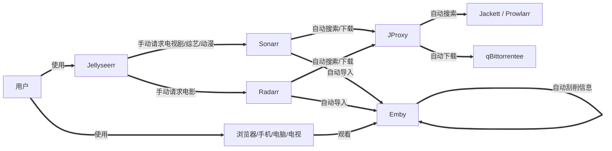
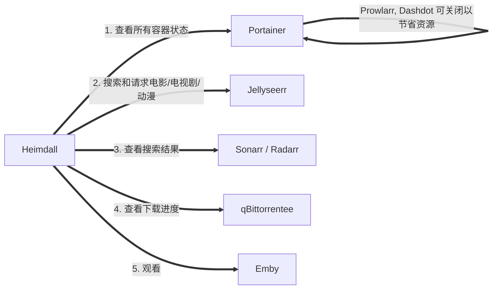

- [🌟 自动化家庭影院 🌟](#-自动化家庭影院-)
  - [🐳 简介](#-简介)
  - [🔥 配置](#-配置)
    - [💻 1. 硬件](#-1-硬件)
    - [🐧 2. 系统](#-2-系统)
    - [🌐 3. 网络](#-3-网络)
  - [👨‍💻 安装](#-安装)
    - [1. 安装 docker](#1-安装-docker)
    - [2. 安装 automatic-theater](#2-安装-automatic-theater)
      - [2.1. 前期准备](#21-前期准备)
      - [2.2. 拉取项目并执行配置脚本](#22-拉取项目并执行配置脚本)
      - [2.3. 拉取镜像并创建容器](#23-拉取镜像并创建容器)
  - [📺 使用](#-使用)
  - [😘 如何贡献](#-如何贡献)
  - [🃏 使用许可](#-使用许可)

# 🌟 自动化家庭影院 🌟

## 🐳 简介

> 最近折腾了一套自动化家庭影院，但是配置起来较为麻烦，所以利用 docker 方便部署和迁移的特点，提前配置好并打包，并利用脚本进行快速迁移部署，开箱即用，无须再对每个系统进行繁琐的配置

😊 本项目的大致流程



🤗 本项目涉及系统

| 系统 | 功能 | 汉化 | 说明 |
| :---: | :---: | :---: | :---: |
| [Heimdall](https://github.com/linuxserver/Heimdall) | 程序仪表盘  | ⭕ | 导航页，自定义了 CSS 和 JS，开箱即用 |
| [Portainer](https://github.com/portainer/portainer) | 容器管理系统 | ⭕ | 方便启动或关闭容器，查看日志等 |
| [Emby](https://emby.media) | 媒体服务器 | ⭕ | 刮削信息，提供观看服务 |
| [Jellyseerr](https://github.com/Fallenbagel/jellyseerr) | 聚合搜索 | ⭕ | 搜索并推送到 Sonarr / Radarr |
| [Radarr](https://github.com/Radarr/Radarr) | 电影订阅 | ⭕ | 定时搜索，下载，重命名并导入 |
| [Sonarr](https://github.com/Sonarr/Sonarr) | 电视剧，综艺和动漫订阅 | ❌ | 定时搜索，下载，重命名并导入 |
| [Jackett](https://github.com/Jackett/Jackett) | 种子站代理 | ❌ | 可添加种子站，提供种子搜索，支持结果缓存 |
| [FlareSolverr](https://github.com/FlareSolverr/FlareSolverr) | 绕过 Cloudflare 和 DDoS-GUARD | - | Jackett / Prowlarr 已配置，无其他操作 |
| [JProxy](https://github.com/LuckyPuppy514/jproxy) | Jackett / Prowlarr 代理 | ⭕ | 优化 Sonarr 识别率，主要针对动漫 |
| [qBittorrentee](https://github.com/SuperNG6/Docker-qBittorrent-Enhanced-Edition) | 下载客户端 | ⭕ | qBittorrent 增强版 |
| [Dashdot](https://github.com/MauriceNino/dashdot) | 系统性能监控 | ❌ | 监控 CPU，内存，硬盘，网络信息 |
| [Prowlarr](https://github.com/Prowlarr/Prowlarr) | 种子站代理 | ⭕ | 相较于 Jackett，多了自动同步配置，但是好像没有缓存，作为备用选择，可自行切换 |

Heimdall


Portainer


Emby


Jellyseerr


Radarr


Sonarr


Jackett


JProxy


qBittorrentee


Dashdot


Prowlarr


## 🔥 配置

### 💻 1. 硬件

| 名称 | 推荐配置 | 说明 |
| :---: | :---: | :---: |
| CPU | 4核 | 例如：J1900, J3160, J4125 等 |
| GPU | 非必要 | 主要用于 Emby 为转码提供硬件加速 |
| 内存 | 4G | 4G 完全够用，2G 较为勉强 |
| 固态 | 32G | 主要用于创建容器，保存配置，16G 够用 |
| 硬盘 | 512G | 取决于你的视频数量，也可以参考 [cloud-drive](https://github.com/LuckyPuppy514/cloud-drive) 挂载云盘 |
| 网络 | 100M | 内网速率 100M 或以上，无线最好支持 5G |

### 🐧 2. 系统

支持 docker, docker-compose 即可，例如：

- debian
- ubuntu
- openwrt
- unraid
- 群晖
  ......

### 🌐 3. 网络

🔥 重要事情说三遍，必须能够科学上网 🔥  
🔥 重要事情说三遍，必须能够科学上网 🔥  
🔥 重要事情说三遍，必须能够科学上网 🔥  

执行以下命令，如果能够输出网页代码，则说明可以科学上网

```bash
curl https://www.youtube.com
```

🙏 如果你是能够处理以下问题的大佬，可以不用科学上网

- 😢 docker 镜像拉取慢
- 😰 无法访问 TMDB, TVDB
- 😭 索引器经常无法使用

## 👨‍💻 安装

### 1. 安装 docker

docker (debian / ubuntu / centos)

```bash
sudo curl -fsSL https://get.docker.com | bash -s docker --mirror Aliyun
```

> 其他系统请参考：[菜鸟教程](https://www.runoob.com/docker/docker-tutorial.html) 或自行查阅相关资料

docker-compose

```bash
# 查看版本号，如有则不需要安装
sudo docker-compose -v
```

```bash
# 下载
sudo curl -L "https://github.com/docker/compose/releases/download/1.29.2/docker-compose-$(uname -s)-$(uname -m)" -o /usr/local/bin/docker-compose

# 添加可执行权限
sudo chmod +x /usr/local/bin/docker-compose
```

### 2. 安装 automatic-theater

#### 2.1. 前期准备

查看当前用户

```bash
id
```

如果是 root 用户，且没有非 root 用户，新增用户

```bash
useradd 用户名
```

查看非 root 用户信息

```bash
id 用户名
```


> 🔥 记住用户id和名称，以及组id和名称 🔥

#### 2.2. 拉取项目并执行配置脚本

```bash
sudo git clone https://github.com/LuckyPuppy514/automatic-theater.git && sudo chmod -R 777 automatic-theater && cd automatic-theater && ./install.sh
```

#### 2.3. 拉取镜像并创建容器

拉取镜像

```bash
sudo docker-compose pull
```

> 因为镜像较多，拉取较慢，某个失败或卡着，ctrl+c 强制停止，再次执行即可，多试几次

创建容器并启动

```bash
sudo docker-compose up -d
```

> 因为容器较多，启动较慢，请耐心等待

## 📺 使用



[🌟【Emby 客户端】多平台优化 支持弹幕 集成 Anime4K 提升动漫画质 🌟](https://www.lckp.top/archives/embyanime4k)

| 名称 | 地址 | 用户名 | 密码 |
| :---: | :---: | :---: | :---: |
| Heimdall | `https://ip:10443`  | - | - |
| Portainer | `http://ip:9000` | atm | atm@2022 |
| Jellyseerr | `http://ip:5055` | atm | atm@2022 |
| Sonarr | `http://ip:8989` | - | - |
| Radarr | `http://ip:7878` | - | - |
| Jackett | `http://ip:9117` | - | - |
| FlareSolverr | `http://ip:8191` | - | - |
| JProxy | `http://ip:8117` | jproxy | jproxy@2022 |
| qBittorrentee | `http://ip:8080` | atm | atm@2022 |
| Emby | `http://ip:8096` | atm | atm@2022 |
| Dashdot | `http://ip:3001` | - | - |
| Prowlarr | `http://ip:9696` | - | - |

🔥 注意：如需开启外网访问，注意修改对应系统的密码和 API Key，并同时修改其他系统中的配置 🔥

## 😘 如何贡献

非常欢迎你的加入！[提一个 Issue](https://github.com/LuckyPuppy514/automatic-theater/issues/new) 或者提交一个 Pull Request

## 🃏 使用许可

[MIT](https://github.com/LuckyPuppy514/automatic-theater/blob/main/LICENSE) © LuckyPuppy514
