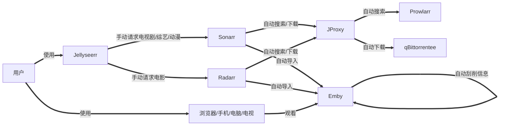
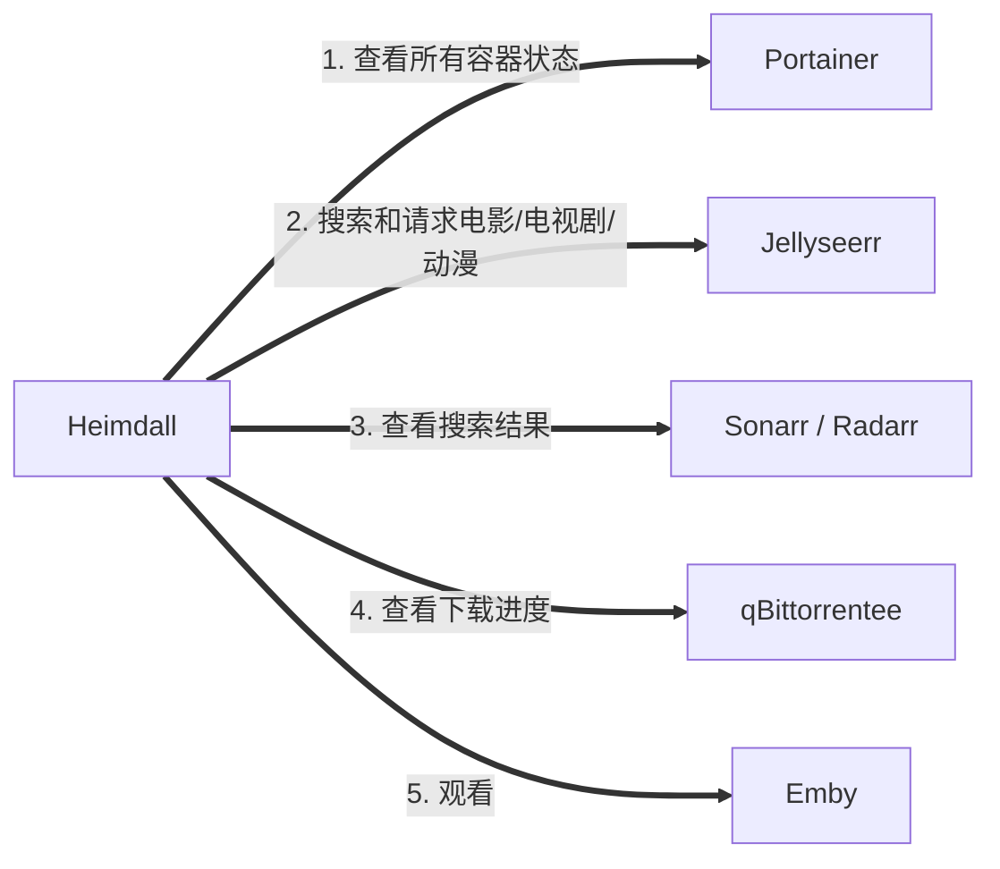

- [🌟 自动化家庭影院 🌟](#-自动化家庭影院-)
  - [🐳 简介](#-简介)
  - [🔥 配置](#-配置)
    - [💻 1. 硬件](#-1-硬件)
    - [🐧 2. 系统](#-2-系统)
    - [🌐 3. 网络](#-3-网络)
  - [👨‍💻 安装](#-安装)
    - [1. 安装 docker 和 docker-compose](#1-安装-docker-和-docker-compose)
      - [1.1. docker](#11-docker)
      - [1.2. docker-compose](#12-docker-compose)
    - [2. 安装 automatic-theater](#2-安装-automatic-theater)
      - [2.1. 下载项目](#21-下载项目)
      - [2.1. 修改配置文件](#21-修改配置文件)
      - [2.3. 执行安装脚本](#23-执行安装脚本)
      - [2.4. 拉取镜像](#24-拉取镜像)
      - [2.4. 启动和关闭](#24-启动和关闭)
  - [📺 使用](#-使用)
  - [😘 如何贡献](#-如何贡献)
  - [🃏 使用许可](#-使用许可)

# 🌟 自动化家庭影院 🌟

## 🐳 简介

> 最近折腾了一套自动化家庭影院，但是配置起来较为麻烦，所以利用 docker 方便部署和迁移的特点，提前配置好并打包，并利用脚本进行快速迁移部署，开箱即用，无须再对每个系统进行繁琐的配置

😊 本项目的大致流程



🤗 本项目涉及系统

| 系统 | 功能 | 汉化 | 说明 |
| :---: | :---: | :---: | :---: |
| [Heimdall](https://github.com/linuxserver/Heimdall) | 程序仪表盘  | ⭕ | 导航页，自定义了 CSS 和 JS，开箱即用 |
| [Portainer](https://github.com/portainer/portainer) | 容器管理系统 | ⭕ | 方便启动或关闭容器，查看日志等 |
| [Emby](https://emby.media) | 媒体服务器 | ⭕ | 刮削信息，提供观看服务 |
| [Jellyseerr](https://github.com/Fallenbagel/jellyseerr) | 聚合搜索 | ⭕ | 搜索并推送到 Sonarr / Radarr |
| [Radarr](https://github.com/Radarr/Radarr) | 电影订阅系统 | ⭕ | 定时搜索，下载，重命名并导入 |
| [Sonarr](https://github.com/Sonarr/Sonarr) | 电视剧和动漫订阅系统 | ⭕ | 定时搜索，下载，重命名并导入 |
| [Prowlarr](https://github.com/Prowlarr/Prowlarr) | 种子站代理 | ⭕ | 可添加种子站，提供种子搜索，支持结果缓存 |
| [FlareSolverr](https://github.com/FlareSolverr/FlareSolverr) | 绕过 Cloudflare 和 DDoS-GUARD | - | Prowlarr 已配置，无其他操作 |
| [JProxy](https://github.com/LuckyPuppy514/jproxy) | 种子站代理过滤 | ⭕ | 介于 Sonarr / Radarr 和 Prowlarr / Prowlarr 之间的代理，主要用于优化查询和提升识别率 |
| [qBittorrent](https://github.com/qbittorrent/qBittorrent) | 下载客户端 | ⭕ | qBittorrent |
| [ChineseSubFinder](https://github.com/ChineseSubFinder/ChineseSubFinder) | 字幕下载 | ⭕ | 自动下载电影和电视剧字幕 |

Heimdall


Portainer


Emby


Jellyseerr


Radarr


Sonarr


Prowlarr


JProxy


qBittorrent


ChineseSubFinder


## 🔥 配置

### 💻 1. 硬件

| 名称 | 推荐配置 | 说明 |
| :---: | :---: | :---: |
| CPU | 4核 | 例如：J1900, J3160, J4125 等 |
| GPU | 非必要 | 主要用于 Emby 为转码提供硬件加速 |
| 内存 | 4G | 4G 完全够用，2G 较为勉强 |
| 固态 | 32G | 主要用于创建容器，保存配置 |
| 硬盘 | 512G | 取决于你的视频数量，也可以参考 [cloud-drive](https://github.com/LuckyPuppy514/cloud-drive) 挂载云盘 |
| 网络 | 100M | 内网速率 100M 或以上，无线最好支持 5G |

### 🐧 2. 系统

支持 docker, docker-compose 即可，例如：

- debian
- ubuntu
- openwrt
- unraid
- 群晖
  ......

### 🌐 3. 网络

🔥 重要事情说三遍，必须能够科学上网 🔥  
🔥 重要事情说三遍，必须能够科学上网 🔥  
🔥 重要事情说三遍，必须能够科学上网 🔥  

执行以下命令，如果能够输出网页代码，则说明可以科学上网

```bash
curl https://www.youtube.com
```

🙏 如果你是能够处理以下问题的大佬，可以不用科学上网

- 😢 docker 镜像拉取慢
- 😰 无法访问 TMDB, TVDB
- 😭 索引器经常无法使用

## 👨‍💻 安装

安装会用到以下命令，请先自行安装，这里仅提供 ubuntu / debian 的安装方式

```bash
apt install sudo git curl
```

### 1. 安装 docker 和 docker-compose

#### 1.1. docker

执行下面的命令，如果有输出版本号证明已经安装

```bash
sudo docker -v
```

未安装，则执行下面的命令进行安装 (debian / ubuntu / centos)

```bash
sudo curl -fsSL https://get.docker.com | bash -s docker --mirror Aliyun
```

> 其他系统请参考：[菜鸟教程](https://www.runoob.com/docker/docker-tutorial.html) 或自行查阅相关资料

#### 1.2. docker-compose

执行下面的命令，如果有输出版本号证明已经安装

```bash
sudo docker-compose -v
```

未安装，则执行下面的命令进行安装

```bash
sudo curl -L "https://github.com/docker/compose/releases/download/v2.11.2/docker-compose-$(uname -s)-$(uname -m)" -o /usr/local/bin/docker-compose && sudo chmod +x /usr/local/bin/docker-compose
```

### 2. 安装 automatic-theater

#### 2.1. 下载项目

```bash
sudo git clone https://github.com/LuckyPuppy514/automatic-theater.git
```

如果提示找不到 git 命令

- 方法一：自行查找自己系统安装 git 的方式
- 方法二：[👆 点我下载 👆](https://github.com/LuckyPuppy514/automatic-theater/archive/refs/heads/main.zip) 解压后上传对应目录（记得修改目录名称为 `automatic-theater`）

#### 2.1. 修改配置文件

在 automatic-theater 目录下执行

```bash
sudo vi docker-compose-default.env
```

- 删除：delete
- 输入：i
- 保存并退出：ESC 输入 :wq


> 不会使用 vi 可下载到本地修改后上传

#### 2.3. 执行安装脚本

在 automatic-theater 目录下执行

```bash
sudo chmod -R 777 * && sudo ./install.sh
```


#### 2.4. 拉取镜像

```bash
sudo docker-compose pull
```

> 因为镜像较多，拉取较慢，某个失败或卡着，ctrl+c 强制停止，再次执行即可，多试几次


#### 2.4. 启动和关闭

启动

```bash
sudo docker-compose up -d
```

关闭

```bash
sudo docker-compose down
```

> 后续启动和关闭等操作可以在 Portainer 中执行
> 修改参数建议还是修改 docker-compose.yml 和 .env

## 📺 使用



[🌟 【Emby客户端】多平台免费优化版 🌟](https://kutt.lckp.top/jOPDvh)

| 名称 | 地址 | 用户名 | 密码 |
| :---: | :---: | :---: | :---: |
| Heimdall | `https://ip:60211`  | - | - |
| Portainer | `http://ip:60212` | atm | atm@20230101 |
| FlareSolverr | `http://ip:60213` | - | - |
| Prowlarr | `http://ip:60223` | atm | atm@20230101 |
| JProxy | `http://ip:60215` | atm | atm@20230101 |
| Jellyseerr | `http://ip:60216` | atm | atm@20230101 |
| Radarr | `http://ip:60217` | atm | atm@20230101 |
| Sonarr | `http://ip:60218` | atm | atm@20230101 |
| qBittorrent | `http://ip:60219` | atm | atm@20230101 |
| ChineseSubFinder | `http://ip:60221` | atm | atm@20230101 |
| Emby | `http://ip:60220` | atm | atm@20230101 |

🔥 注意：如需开启外网访问，注意修改对应系统的密码和 API Key，并同时修改其他系统中的配置 🔥

## 😘 如何贡献

非常欢迎你的加入！[提一个 Issue](https://github.com/LuckyPuppy514/automatic-theater/issues/new) 或者提交一个 Pull Request

## 🃏 使用许可

[MIT](https://github.com/LuckyPuppy514/automatic-theater/blob/main/LICENSE) © LuckyPuppy514
